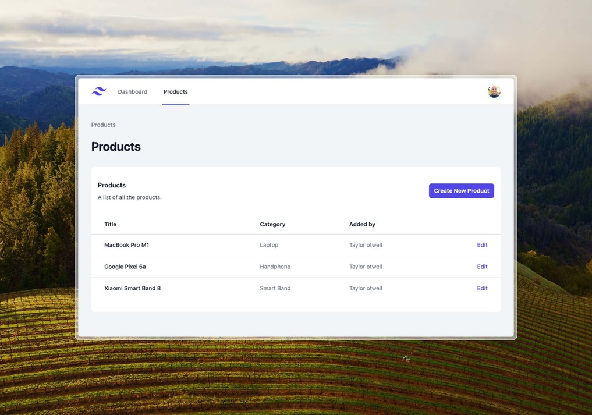

# An example of CRUD operations in Refiber



# How to run it?

I recommend using [Air](https://github.com/cosmtrek/air) for live reloading.

```
git clone https://github.com/refiber/example-crud.git

cd example-crud

npm i && npm run build

air
```

> If you're new to the Refiber framework, simply open the route file at `/routes/web.go`, then follow the pattern from the route to the controller and finally to the view.

## Refiber

Refiber is a web framework based on the [Gofiber](gofiber.io) framework, follows the MVC architecture (Model, View & Controller).

Refiber comes with [Inertia.js](https://inertiajs.com/) built-in. [Inertia.js](https://inertiajs.com/) is a powerful tool for creating Single Page Applications (SPA) without needing a separate API.

```go
// in your Controller
func (web *webController) Index(s support.Refiber) error {
	return web.inertia.Render().Page("Home", &fiber.Map{
		"hello": "World",
	})
}
```

```tsx
// in your React App
export default function HomePage({ hello }) {
	return <h1>Hello {hello}</h1>;
}
```

## Documentation

Online documentation [https://refiber.notion.site](https://refiber.notion.site/Refiber-Docs-613336569bcd439ca74c27e30d46a491?pvs=4)

## Quick Install

To install Refiber, you first need to install the CLI. Use the following command:

```
go install github.com/refiber/refiber-cli@latest
```

Now you can just run this command bellow to create a new Refiber project

```
refiber-cli new my-app
```
